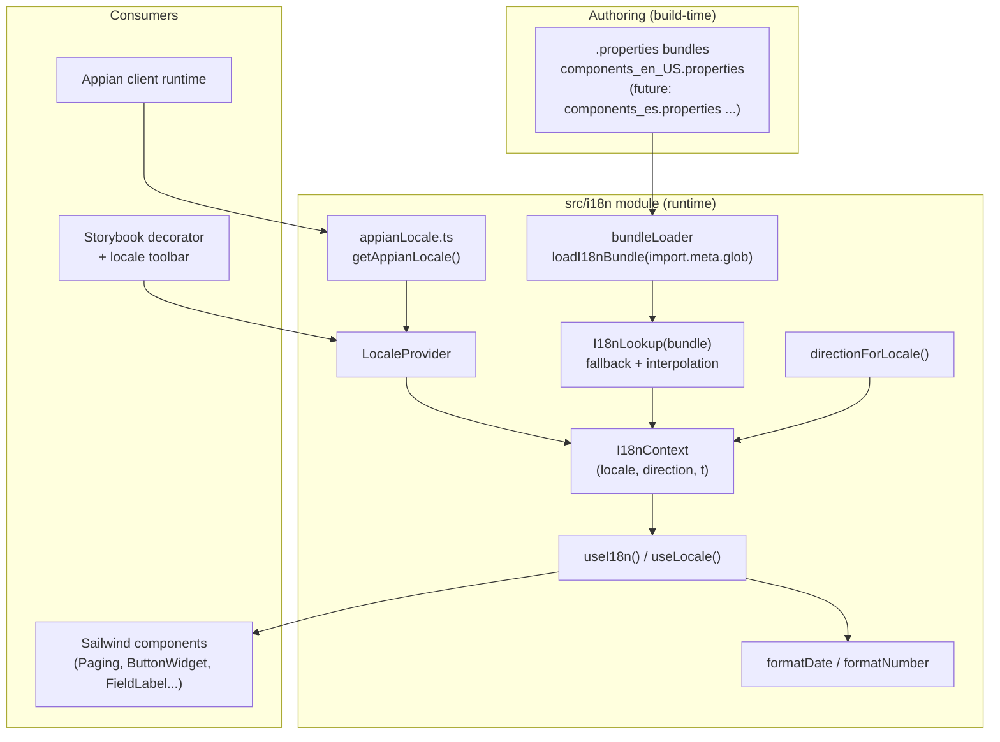
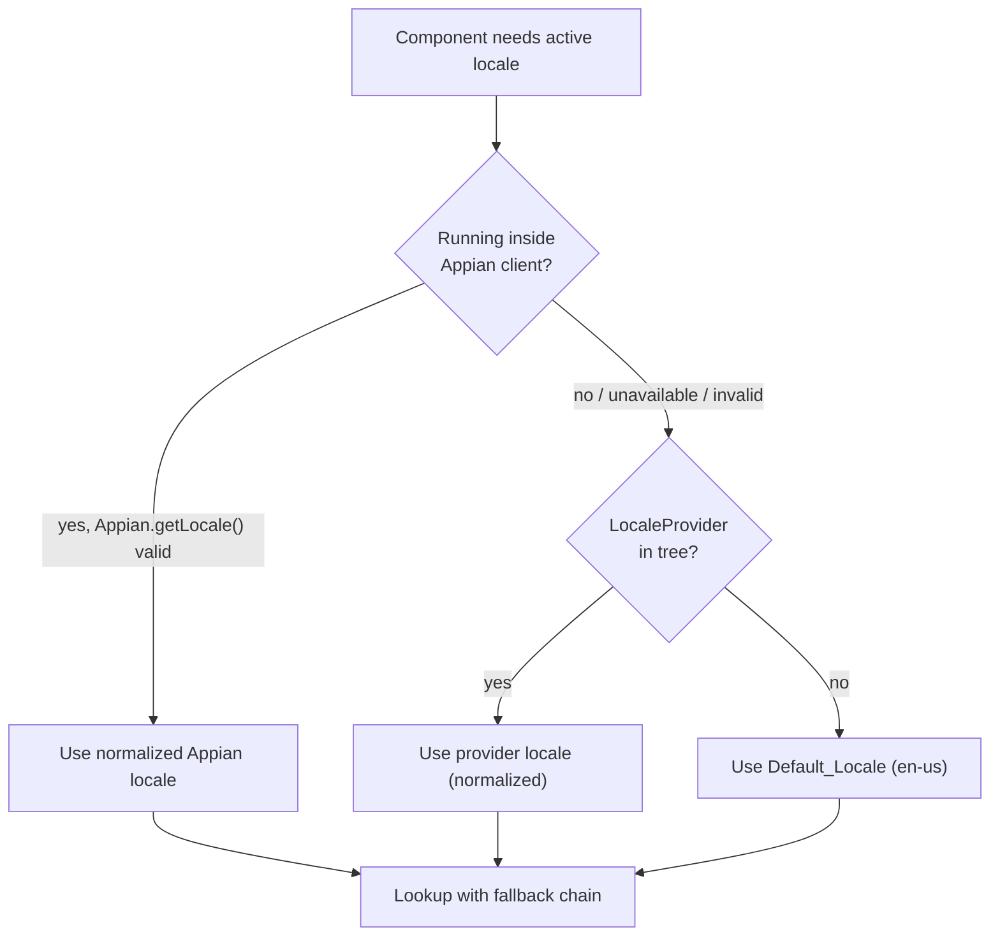

# Design Document: Component Internationalization (component-i18n)

## Overview

This design adds an internationalization (i18n) subsystem to the Sailwind React component library so that library-owned text and locale-driven formatting become locale-aware, and so the library can be packaged as an Appian Component Plug-in with full multi-language support. It mirrors the proven internal Appian `ui-library` approach (`I18nLookup` + `.properties` bundles) rather than adopting a third-party i18n framework.

The design is anchored by three non-negotiable constraints from the requirements and the confirmed scope:

1. **Backward compatibility is absolute.** With no `LocaleProvider` in the tree, every component must render byte-for-byte the same English text it renders today, and no existing public prop may be removed or renamed (Requirement 5).
2. **Lightweight, in-house lookup.** The translation engine is a small, dependency-free port of the `ui-library` `I18nLookup` / `loadI18nBundle` pattern, adapted from webpack's `require.context` to Vite's `import.meta.glob` (technical context; Requirement 2, 3).
3. **Appian-first conventions.** Bundles are Appian-convention `.properties` files (`<BundleName>_<locale>.properties`), and the runtime detects the Appian client to source the locale from `Appian.getLocale()` (Requirements 3, 6, 7).

### Confirmed scope for v1

| Area | v1 Decision |
| --- | --- |
| Locales shipped | **`en-US` only** (the default bundle). Architecture must make adding locales a drop-in `.properties` file with no code change. |
| RTL / `Text_Direction` | **Design and expose** direction through the provider/context/hook and document component consumption, but **applying** RTL layout to components is **optional for v1**. Tasks phase should mark RTL-application tasks optional. |
| Translation mechanism | In-house `I18nLookup` + `loadI18nBundle` port. **No** react-i18next / FormatJS / other libraries. |
| Locale-aware formatting | **Date and number** formatting via the `Intl` API are in scope. **Currency and relative-time are deferred** (future considerations). |

> **Note (post-implementation):** a temporary, unreviewed `es` smoke-test fixture bundle (`components_es.properties`) exists solely to manually exercise locale switching in Storybook. It is **not** an officially shipped locale — v1 still ships `en-US` only as the authored, reviewed translation. See `SUPPORTED_LOCALES` and the "Bundle file model" section below.
>
> **Note (post-implementation):** the direction→`dir` reference wiring described under `directionForLocale` is now in place in `FieldWrapper` and `Paging` (`dir={direction === 'RTL' ? 'rtl' : undefined}`), a no-op for `LTR`/`en-us`. Full layout mirroring beyond the `dir` attribute is still deferred.

### Goals

- All library-owned user-facing strings and generated ARIA text resolve through a single lookup with predictable fallback.
- A `LocaleProvider` + `useI18n` / `useLocale` hook API for consumers, Storybook, and standalone prototypes.
- Locale-aware date/number formatting helpers built on `Intl`.
- A `Text_Direction` value derived from the active locale, exposed for future RTL work.
- An Appian locale bridge that is inert and safe outside the Appian client.
- A clear path from the same `.properties` sources to Appian plug-in packaging (designer + user bundles).

### Non-Goals (v1)

- Shipping non-English translations (only the `en-US` default bundle is authored).
- Actually re-laying-out components for RTL (only the direction signal is provided).
- Currency and relative-time formatting.
- Translating consumer-supplied text (consumer strings always pass through untouched — Requirement 4.3).

## Architecture

### High-level structure

The i18n subsystem lives in a new `src/i18n/` module and is consumed by components through a hook. Bundles are authored as `.properties` files colocated in `src/i18n/bundles/` and assembled at build time by Vite.



### Layering and the two-layer SAIL convention

The i18n module sits beneath the component layer and is orthogonal to the existing two-layer SAIL API + Tailwind implementation architecture (see `AGENTS.md`). Components keep their SAIL-exact public props (UPPERCASE values, Item + Field patterns) unchanged. Internally, where a component previously wrote a hardcoded literal, it now calls `t('someKey')` from the `useI18n()` hook. This is purely an implementation-layer change; the SAIL API layer is untouched.

### Locale resolution precedence

The active locale for any component is resolved in this order (Requirements 1, 5, 6):



Key design decision: **the Appian bridge feeds the provider, it does not bypass it.** The `LocaleProvider` computes its effective locale as `appianLocale ?? propLocale ?? DEFAULT_LOCALE`. This keeps a single source of truth (the context) and means a component never needs to know whether it is inside Appian. It also preserves backward compatibility: with no provider at all, `useI18n()` returns a default-locale-bound instance (Requirement 1.3, 5.5).

### Backward-compatibility strategy

Three mechanisms guarantee Requirement 5:

1. **Default-locale bundle equals today's strings.** The `_en_US`/default bundle is authored by copying the exact current literals (`"First page"`, `"No items available"`, etc.). Because the fallback chain always terminates at the default locale, and v1 ships only the default, output is identical.
2. **No-provider path returns the default instance.** `useI18n()` reads the context default value (a real, initialized lookup bound to `en-us`), not `undefined`. There is no "provider required" error path.
3. **Consumer-supplied text is never looked up.** Components resolve a library default only when the consumer omits the prop. Props that today have a literal default (e.g., `emptyGridMessage = "No items available"`) change their default *sentinel* to `undefined` and resolve the library default via `t()` when `undefined` — the observable render for `en-US` is unchanged, the prop name/type/behavior are preserved (Requirement 5.2, 4.3, 4.4).

## Components and Interfaces

### Module layout

```
src/i18n/
├── index.ts                 # public exports (LocaleProvider, useI18n, useLocale, formatters, types)
├── I18nLookup.ts            # pure lookup + interpolation (port of ui-library)
├── interpolateNodes.tsx     # node-aware interpolation for styled placeholders
├── bundleLoader.ts          # loadI18nBundle via import.meta.glob
├── context.tsx              # I18nContext + LocaleProvider + hooks
├── direction.ts             # directionForLocale(), RTL language table
├── format.ts                # formatDate / formatNumber (Intl)
├── appianLocale.ts          # getAppianLocale() bridge (safe global access)
├── normalizeLocale.ts       # shared locale normalization
├── keys.ts                  # Translation_Key constants (typed catalog)
└── bundles/
    ├── components.properties          # default (en-US) — REQUIRED, complete
    └── components_es.properties       # smoke-test fixture (Spanish, unreviewed)
```

### Type definitions

```typescript
// A supported, normalized locale code (lowercase, hyphenated). v1 supports only 'en-us'.
export type LocaleCode = string

// The in-memory bundle: normalized locale -> (key -> value)
export type I18nBundle = Record<string, Record<string, string>>

// Reading direction implied by a locale.
export type TextDirection = 'LTR' | 'RTL'

// The curried lookup: call with (locale, key, ...args) or (locale) => (key, ...args) => string
export interface I18nLookupFunction {
  (locale: string, key: string, ...args: unknown[]): string
  (locale: string): (key: string, ...args: unknown[]) => string
}

// A translation function already bound to the active locale.
export type TranslateFn = (key: string, ...args: unknown[]) => string

// Shape returned by the useI18n() hook.
export interface I18nContextValue {
  /** Active, normalized locale code (e.g., 'en-us'). */
  locale: LocaleCode
  /** Translation function bound to the active locale. */
  t: TranslateFn
  /** Reading direction implied by the active locale. */
  direction: TextDirection
}

export interface LocaleProviderProps {
  /** Locale to apply to descendants. Appian-form or internal-form accepted. */
  locale?: string
  children: React.ReactNode
}
```

### `I18nLookup` (pure lookup + interpolation)

Direct port of the `ui-library` implementation with typing tightened. Signature and behavior are preserved so the two codebases stay conceptually aligned.

```typescript
export function I18nLookup(bundle: I18nBundle): I18nLookupFunction
```

Fallback order for `lookup(locale, key, ...args)` (Requirement 2.1–2.4):

1. Normalize `locale` (trim, `_`→`-`, lowercase) — Requirement 2.6.
2. If `key` is empty/absent → return `''` (Requirement 2.5).
3. Exact match `bundle[locale][key]` → interpolate and return.
4. Language-only match `bundle[lang][key]` where `lang = locale.split('-')[0]` → interpolate and return.
5. Default match `bundle['en-us'][key]` → interpolate and return.
6. Otherwise return `key` unchanged.

Interpolation (Requirement 2.7–2.8): replace each `{n}` with the string form of `args[n]`; if `args[n]` is `undefined`/`null` or absent, leave the `{n}` token unchanged.

### Node-aware interpolation (`interpolateNodes`)

```typescript
export function interpolateNodes(template: string, args: ReactNode[]): ReactNode[]
```

`I18nLookup`'s interpolation only ever produces a `string`, which is sufficient when every substituted value is plain text. It is not sufficient when a placeholder must be a styled or otherwise non-text React element — for example, the bold "start – end" page range in `Paging`, which needs to render as a `<span className="font-bold">` nested inside a larger translatable phrase. Concatenating strings around a styled span would restore the styling at the cost of hardcoding word order outside the translation, which defeats the purpose of externalizing the phrase.

`interpolateNodes` solves this without concatenation: it takes an already-*resolved* template string (call `t(key)` with **no** interpolation arguments so its `{n}` placeholders survive) and splices `ReactNode`s into it directly. The phrase — and its word order — still comes from one translatable string; only the *content* of each placeholder is a node instead of text. Missing-argument behavior mirrors the string interpolation exactly: a placeholder is substituted only when the corresponding `args[index]` is provided and not `undefined`, otherwise the literal `{index}` token is left unchanged.

Consumers get this via the `t(key)`-with-no-args template + `interpolateNodes` pattern (see "Component integration pattern" below for the Paging example). `interpolateNodes` is exported from `src/i18n/index.ts` alongside the rest of the public API.

### `bundleLoader` (Vite `import.meta.glob`)

Replaces webpack `require.context` with Vite's compile-time glob. `.properties` files are imported eagerly as raw strings, parsed into key/value maps, filtered for `.##CONTEXT##`, keyed by normalized locale, and handed to `I18nLookup`.

```typescript
// Eagerly import every bundle as raw text at build time.
const files = import.meta.glob('./bundles/*.properties', {
  eager: true,
  query: '?raw',
  import: 'default',
}) as Record<string, string>

export function loadI18nBundle(
  files: Record<string, string>
): I18nLookupFunction
```

Loader rules:

- File name → locale via regex `/_([a-z]{2}(?:_[A-Z]{2})?)\.properties$/` (Requirement 3.2). Normalize `_`→`-`, lowercase (Requirement 3.3).
- A file with **no** `_<locale>` suffix (`components.properties`) is treated as the **Default_Locale** bundle and keyed under `en-us` (Requirement 3.6).
- A file whose suffix does not match the language/region pattern is **skipped**, and loading continues (Requirement 3.7).
- Keys containing `.##CONTEXT##` are excluded (Requirement 3.4).
- `.properties` parsing decodes `\uXXXX` escapes to Unicode (Requirement 3.5); a malformed `\u` sequence with fewer than four hex digits is left literal and parsing continues (Requirement 3.8).

A minimal `.properties` parser is required (no external dependency): split on newlines, ignore blank lines and `#`/`!` comments, split each line on the first `=` (or `:`), trim the key, preserve the value, then decode Unicode escapes.

### `LocaleProvider`, `I18nContext`, and hooks

```typescript
export const LocaleProvider: React.FC<LocaleProviderProps>
export function useI18n(): I18nContextValue
export function useLocale(): { locale: LocaleCode; direction: TextDirection }
```

- `I18nContext` is created with a **fully-initialized default value** bound to `en-us` (never `undefined`), so `useI18n()` outside any provider returns working defaults (Requirement 1.3, 5.5).
- `LocaleProvider` computes its effective locale once per render: `normalize(getAppianLocale() ?? props.locale ?? DEFAULT_LOCALE)`, validates it against supported locales, warns and falls back on unsupported values (Requirement 1.6, 10.3), derives `direction` via `directionForLocale`, builds a memoized `t = lookup(effectiveLocale)`, and provides `{ locale, t, direction }`.
- Nesting resolves to the nearest provider because React context already does (Requirement 1.5). Changing `locale` re-renders descendants in the same commit (Requirement 1.4, 9.4) because it flows through context value identity.
- `useI18n` and `useLocale` simply `useContext(I18nContext)`.

### `directionForLocale` (Text_Direction helper)

```typescript
export function directionForLocale(locale: string): TextDirection
```

- Maintains a small set of RTL language subtags: `ar`, `he`, `fa`, `ur` (extendable).
- Returns `'RTL'` when the normalized locale's language subtag is in the set (Requirement 9.2), `'LTR'` otherwise, including for absent/unknown locales (Requirement 9.3, 9.5).
- **v1 scope (as-built):** the value is computed and exposed via context/hook, and is now consumed as a **reference implementation** in `FieldWrapper` and `Paging`: `dir={direction === 'RTL' ? 'rtl' : undefined}`. The conditional is deliberate — for `LTR`/`en-us` it evaluates to `undefined`, so no `dir` attribute is emitted and there is zero DOM change versus pre-i18n output (preserving Requirement 5). Other components are **not** required to consume it yet, and full layout mirroring (spacing, icon direction, etc.) beyond the `dir` attribute remains optional/deferred.

### Formatting helpers (`format.ts`)

```typescript
export function formatDate(
  value: Date | string | number | null | undefined,
  locale: string,
  options?: Intl.DateTimeFormatOptions
): string

export function formatNumber(
  value: number | string | null | undefined,
  locale: string,
  options?: Intl.NumberFormatOptions
): string
```

Behavior (Requirement 8):

- Valid input + active locale → `Intl.DateTimeFormat` / `Intl.NumberFormat` for that locale (8.1, 8.2).
- No active locale → default locale (8.3).
- Unrecognized/unsupported locale (constructor throws `RangeError`) → retry with default locale (8.4).
- `null`/`undefined`/unparseable → return `''` without throwing (8.5).
- If even the default locale fails to format → return the value's default string representation (`String(value)`), without throwing (8.6).

Component-facing usage will typically pull the locale from the hook: a thin convenience is exposed so grids and other components can format without threading locale manually. Currency and relative-time helpers are intentionally **not** included in v1 (future considerations).

**Hardened for any input (as-built):** `toValidDate`/`toValidNumber` wrap their coercion (`new Date(value)` / `Number(value)`) in `try/catch`. Some exotic inputs (`Symbol`, `BigInt`, etc.) make the coercion itself throw a `TypeError` rather than yield an invalid date/`NaN`; that throw is now caught and treated the same as an unparseable value, returning `''`. This makes both helpers total for **any** input, not just the invalid-but-non-throwing cases originally covered, strengthening Requirement 8.5/8.6.

### Appian locale bridge (`appianLocale.ts`)

```typescript
export function getAppianLocale(): string | null
```

Safely reads the ambient Appian locale without breaking non-Appian environments (Storybook, standalone, tests):

- Guard every access: check `typeof globalThis !== 'undefined'`, then whether a global `Appian` object exists and exposes a `getLocale` function, inside a `try/catch`.
- If present, call `Appian.getLocale()`, coerce to string; return `null` for unavailable/null/empty results (Requirement 6.5) or if anything throws.
- Because the value flows into the provider's fallback chain, an invalid or unnormalizable Appian locale naturally falls back through Requirement 2's chain (Requirement 6.3, 6.6).
- A `declare global` ambient type describes the optional `Appian` object so TypeScript compiles without assuming its presence.

### Component integration pattern

Each component that owns text switches literals to keyed lookups. Example (Paging):

```typescript
// Before
aria-label="First page"

// After
const { t } = useI18n()
// ...
aria-label={t('paging.firstPage')}
title={t('paging.firstPage')}
```

For props with library defaults (e.g., `ReadOnlyGrid.emptyGridMessage`), the default sentinel becomes `undefined` and the component resolves via lookup only when the consumer omitted the value:

```typescript
// signature default changes from "No items available" to undefined
emptyGridMessage,
// ...
const emptyText = emptyGridMessage ?? t('grid.emptyMessage')
```

Where a placeholder must be a styled React node rather than plain text — the bold page-range in `Paging` — the component builds the node first, then splices it into the surrounding phrase's template via `interpolateNodes` instead of concatenating strings:

```typescript
const numberRange = (
  <span className="font-bold">{t('paging.numberRange', start, end)}</span>
)

// `t('paging.range')` is called with NO args, so its `{0}`/`{1}` placeholders
// stay intact for the node splice below.
const range = interpolateNodes(t('paging.range'), [numberRange, total])
```

## Data Models

### Translation_Key catalog and namespacing

Keys use a `component.camelCaseName` dotted namespace. This keeps keys stable, readable, collision-free, and maps cleanly onto Appian `.properties` conventions. The default (`en-US`) bundle must contain an entry for **every** key (Requirement 3.6). Keys are also exported as typed constants in `keys.ts` to prevent typos.

| Translation_Key | Default (en-US) value | Source component | Current literal |
| --- | --- | --- | --- |
| `paging.firstPage` | `First page` | `Paging` | `aria-label`/`title` "First page" |
| `paging.previousPage` | `Previous page` | `Paging` | "Previous page" |
| `paging.nextPage` | `Next page` | `Paging` | "Next page" |
| `paging.lastPage` | `Last page` | `Paging` | "Last page" |
| `paging.range` | `{0} of {1}` | `Paging` | full range phrase for `ROW_COUNT` controls; `{0}` is the bold number-range node, `{1}` is the total |
| `paging.rangeMany` | `{0} of many` | `Paging` | full range phrase for `STANDARD` controls; `{0}` is the bold number-range node |
| `paging.numberRange` | `{0} \u2013 {1}` | `Paging` | the bold "start – end" number-range unit, spliced into `paging.range`/`paging.rangeMany` as a single node |
| `button.loading` | `loading` | `ButtonWidget` | `aria-label="loading"` |
| `field.help` | `help` | `FieldLabel`, `StampField` | `aria-label="help"` |
| `field.required` | `required` | `FieldLabel` | `aria-label="required"` |
| `progressBar.label` | `Progress` | `ProgressBar` | default `aria-label` "Progress" |
| `image.openLinked` | `Open linked image` | `ImageField` | default `aria-label` "Open linked image" |
| `grid.emptyMessage` | `No items available` | `ReadOnlyGrid` | `emptyGridMessage` default |

Note on `paging.range` / `paging.rangeMany` / `paging.numberRange` (as-built): the original design considered a single fully-substituted phrase like `"{0} – {1} of {2}"`, but that would have flattened the bold "start – end" range to plain text, losing the visual emphasis the component previously rendered via concatenation. The final decision splits the phrase into two translatable units instead of concatenating markup around a translation: `paging.numberRange` (`{0} \u2013 {1}`) holds just the bold numeric range, and `paging.range`/`paging.rangeMany` hold the surrounding full phrase (`{0} of {1}` / `{0} of many`) with `{0}` reserved for that range. `Paging` calls `t(KEYS.pagingRange)` (or `pagingRangeMany`) with **no** value arguments — so the `{0}`/`{1}` placeholders stay intact in the returned template — then pipes that template through `interpolateNodes` to splice in the bold `numberRange` node (and the total, for `pagingRange`). The range renders bold, the phrase remains one translatable unit per locale, and no string concatenation is involved.

### Bundle file model

`.properties` files are the on-disk model. Each line is `key=value`. Example default bundle (`src/i18n/bundles/components.properties`):

```properties
# Sailwind default (en-US) component strings
paging.firstPage=First page
paging.previousPage=Previous page
paging.nextPage=Next page
paging.lastPage=Last page
paging.range={0} of {1}
paging.rangeMany={0} of many
paging.numberRange={0} \u2013 {1}
button.loading=loading
field.help=help
field.required=required
progressBar.label=Progress
image.openLinked=Open linked image
grid.emptyMessage=No items available
```

Adding a future locale is a pure drop-in: author `components_es.properties` beside the default; `import.meta.glob` picks it up, the loader keys it under `es`, and `es` becomes selectable — **no code change** (satisfies the "trivial to add locales" scope requirement).

### In-memory bundle model

After loading, the `I18nBundle` for v1 is:

```jsonc
{
  "en-us": {
    "paging.firstPage": "First page",
    "paging.previousPage": "Previous page",
    // ... all keys
  }
}
```

### Supported-locale registry

A small constant lists supported normalized locales used for validation/warnings and the Storybook toolbar:

```typescript
export const SUPPORTED_LOCALES: LocaleCode[] = ['en-us'] // v1: en-US only
export const DEFAULT_LOCALE: LocaleCode = 'en-us'
```

Adding a locale bundle should also add its code here (the one code touch for a new locale, used only for the picker/validation — lookup itself is data-driven).

### Appian plug-in packaging model (downstream mapping)

Two distinct bundle families map to Appian packaging:

- **User_Translation** (this library's runtime): `<BundleName>_<locale>.properties` consumed by `I18nLookup`. These ship inside the built library and drive end-user text.
- **Designer_Translation** (Appian design-time): Appian-standard `<rule-name>_<language_code>.properties` bundles, one per component version, carrying the component display name and each parameter's display name/description (Requirement 7). Each component version MUST include a `_en_US` designer bundle containing every such entry; a missing `_en_US` bundle is a deployment-blocking packaging error (Requirement 7.2, 7.3). Designer bundles are authored per the plug-in's component-version folder layout and are not resolved by the runtime `I18nLookup`.

The shared `.properties` format and naming convention are deliberately chosen so the same authoring discipline serves both families.

### Storybook locale selection model

- A global toolbar item (`globalTypes.locale`) lists `SUPPORTED_LOCALES`, defaulting to `en-US` (Requirement 10.4).
- A decorator wraps every story in `<LocaleProvider locale={context.globals.locale}>`, so changing the toolbar re-renders stories under the new locale well within 1 second (Requirement 10.5).
- In `.storybook/preview.tsx`, add `globalTypes` and `decorators`; the toolbar shows each supported locale.

## Correctness Properties

*A property is a characteristic or behavior that should hold true across all valid executions of a system — essentially, a formal statement about what the system should do. Properties serve as the bridge between human-readable specifications and machine-verifiable correctness guarantees.*

The i18n core (lookup, normalization, interpolation, bundle loading, unicode decoding, formatting, and direction mapping) is composed of pure functions over large input spaces, which makes property-based testing (with `fast-check`, already a dev dependency) a strong fit. Provider wiring, Storybook UI, and Appian/plug-in packaging behavior are validated with example, integration, and packaging-validation tests instead (see Testing Strategy).

The prework consolidated 60 acceptance criteria into the following twelve non-redundant properties.

### Property 1: Lookup fallback determinism

*For any* translation bundle, active locale, and key, `I18nLookup` returns the value from the highest-priority tier that contains the key — exact-locale match first, then language-only match, then the Default_Locale (`en-us`) entry — and returns the key unchanged when no tier contains it; if the key is empty or absent it returns the empty string; the lookup never throws for any locale or key input.

**Validates: Requirements 1.7, 2.1, 2.2, 2.3, 2.4, 2.5, 4.6, 5.4, 6.3, 6.6, 10.3, 10.6**

### Property 2: Normalization idempotency and lookup invariance

*For any* locale string, normalization (trim, `_`→`-`, lowercase) is idempotent — normalizing an already-normalized value yields the same value — and `I18nLookup` returns identical results for any casing, underscore/hyphen, or surrounding-whitespace variant of the same locale.

**Validates: Requirements 2.6, 3.3, 6.2**

### Property 3: Positional interpolation

*For any* resolved template string containing positional placeholders `{0}, {1}, … {n}` and any argument list, every placeholder whose index has a non-null, defined argument is replaced by that argument's string representation, and every placeholder whose argument is missing, null, or undefined is left unchanged in the output.

**Validates: Requirements 2.7, 2.8**

### Property 4: Bundle loader filename handling

*For any* set of `.properties` file entries, the Bundle_Loader includes exactly those whose names match `<BundleName>_<locale>.properties` (two-letter language, optional two-letter region) keyed under the normalized locale — treating a suffix-less `<BundleName>.properties` as the `en-us` default — excludes every file that does not match the pattern, and completes without throwing regardless of how many entries are malformed.

**Validates: Requirements 3.2, 3.3, 3.7**

### Property 5: Unicode escape decoding

*For any* `.properties` value, well-formed `\uXXXX` sequences (exactly four hex digits) decode to their corresponding Unicode characters, while malformed sequences with fewer than four hex digits are retained literally, and processing of all other entries continues unaffected.

**Validates: Requirements 3.5, 3.8**

### Property 6: Context-key exclusion

*For any* parsed bundle, every key containing the marker `.##CONTEXT##` is absent from the resulting Translation_Bundle, and every key not containing the marker is retained with its value intact.

**Validates: Requirements 3.4**

### Property 7: No-provider backward-compatibility invariance

*For any* library-owned Translation_Key, resolving that key with no `LocaleProvider` present (active locale defaulting to `en-us`) returns a string character-for-character identical to that key's authored default (`en-US`) value.

**Validates: Requirements 4.5, 5.1**

### Property 8: Consumer text pass-through

*For any* non-empty consumer-supplied text passed to a component text property, the component renders that text exactly as supplied and does not route it through `I18nLookup` (the rendered output equals the input regardless of whether the input happens to match a Translation_Key).

**Validates: Requirements 4.3**

### Property 9: Date formatting matches Intl

*For any* valid date value and any supported locale (or no locale, using the default), `formatDate` returns exactly what `Intl.DateTimeFormat` produces for the resolved locale and options.

**Validates: Requirements 8.1, 8.3**

### Property 10: Number formatting matches Intl

*For any* finite numeric value and any supported locale (or no locale, using the default), `formatNumber` returns exactly what `Intl.NumberFormat` produces for the resolved locale and options.

**Validates: Requirements 8.2, 8.3**

### Property 11: Formatting robustness

*For any* input to a Formatting_Helper: a null, undefined, or unparseable value yields the empty string; an unrecognized or unsupported locale falls back to the Default_Locale; and in all cases the helper returns a string without throwing (returning the value's default string representation if even the default locale cannot format it).

**Validates: Requirements 8.4, 8.5, 8.6**

### Property 12: Direction mapping

*For any* locale string, `directionForLocale` returns `RTL` when the normalized language subtag is a known right-to-left language, and `LTR` in every other case — including left-to-right languages and absent, empty, or unknown locales — invariant to casing, region, and separator form.

**Validates: Requirements 9.2, 9.3, 9.4, 9.5**

## Error Handling

The i18n subsystem is designed to degrade gracefully; no i18n code path may throw into a consumer's render tree. Errors are handled by tier:

### Lookup and resolution

- **Unknown/unsupported active locale:** resolved through the fallback chain to the Default_Locale; the `LocaleProvider` emits a `console.warn` naming the unsupported code (Requirement 1.6, 10.3). Rendering continues uninterrupted.
- **Missing key:** returns the Default_Locale value, or the key itself if absent everywhere, plus a `console.warn` identifying the missing key and locale (Requirement 1.7).
- **Empty/absent key:** returns `''` immediately, no warning (Requirement 2.5).
- **Warnings are dev-signal only.** They never interrupt rendering and are safe to strip in production builds. Warnings must not fire on the normal fallback-to-default path in v1 (since only `en-us` ships, resolving `en-us` is the expected path, not an error).

### Bundle loading

- **Malformed filename / non-matching suffix:** file is skipped; loading continues over the remaining files (Requirement 3.7).
- **Malformed `\u` escape (fewer than four hex digits):** the literal characters are retained; remaining entries still process (Requirement 3.8).
- **Duplicate keys within a file:** last-write-wins (documented, deterministic).
- Loader errors are contained so a single bad bundle cannot break the whole Translation_Bundle.

### Appian bridge

- All access to the global `Appian` object is guarded (`typeof` checks) and wrapped in `try/catch`. Any absence, exception, null, or empty result yields `null` from `getAppianLocale()`, and resolution falls back to the provider or default (Requirement 6.5, 6.6). This guarantees Storybook, tests, and standalone prototypes are unaffected by the bridge.

### Formatting

- Null/undefined/unparseable values → `''` (Requirement 8.5).
- Locale rejected by `Intl` (`RangeError`) → retry with Default_Locale (Requirement 8.4).
- Default locale also fails → `String(value)` (Requirement 8.6).
- No helper throws under any input.
- **As-built:** the value coercion itself (`new Date(value)` / `Number(value)`) is also guarded with `try/catch`, so exotic inputs that throw during coercion (e.g., `Symbol`, `BigInt`) are caught and yield `''` just like any other unparseable value — the helpers are total for any input (Requirement 8.5, 8.6).

### Designer / packaging (downstream)

- A component version missing its required `_en_US` designer bundle is a **deployment-blocking** condition surfaced by a packaging-validation step, identifying the offending component version (Requirement 7.3). This is enforced outside the runtime, in the plug-in build/validation pipeline.

## Testing Strategy

### Property-based tests (fast-check, ≥100 iterations each)

Implemented with the existing `fast-check` dependency, colocated as `*.properties.test.tsx` files matching the current project convention (see `ReadOnlyGrid.properties.test.tsx`). Each test is tagged referencing its design property.

Tag format: `Feature: component-i18n, Property {number}: {property_text}`

| Property | Test location | Generators (arbitraries) |
| --- | --- | --- |
| P1 Fallback determinism | `src/i18n/I18nLookup.properties.test.ts` | random bundles with controlled tier presence, locales, keys |
| P2 Normalization invariance | `src/i18n/normalizeLocale.properties.test.ts` | locale strings with random case/`_`/`-`/whitespace variants |
| P3 Interpolation | `src/i18n/I18nLookup.properties.test.ts` | templates with `{n}` placeholders + arg arrays incl. nullish/short |
| P4 Loader filename handling | `src/i18n/bundleLoader.properties.test.ts` | maps of valid + invalid filenames → content |
| P5 Unicode decoding | `src/i18n/bundleLoader.properties.test.ts` | strings with well-formed and truncated `\u` escapes |
| P6 Context-key exclusion | `src/i18n/bundleLoader.properties.test.ts` | entries with/without `.##CONTEXT##` |
| P7 No-provider invariance | `src/i18n/backwardCompat.properties.test.tsx` | `constantFrom` over the full key catalog vs authored literals |
| P8 Consumer pass-through | `src/i18n/passthrough.properties.test.tsx` | arbitrary non-empty strings into component text props |
| P9 Date formatting | `src/i18n/format.properties.test.ts` | arbitrary valid dates × supported locales × option sets |
| P10 Number formatting | `src/i18n/format.properties.test.ts` | arbitrary finite numbers × supported locales × option sets |
| P11 Formatting robustness | `src/i18n/format.properties.test.ts` | nullish, NaN, unparseable, garbage-locale inputs; extended with deterministic exotic-input `examples` (`Symbol`, `BigInt`, object, array, function) so coercion-throw regressions can't pass silently |
| P12 Direction mapping | `src/i18n/direction.properties.test.ts` | RTL and non-RTL locales with case/region/separator variants |

Notes:
- **P9/P10 avoid asserting brittle literal output.** Because `Intl` output is implementation/ICU-version dependent, the oracle is `Intl` itself: the helper must equal `Intl.DateTimeFormat(locale, opts).format(value)` / `Intl.NumberFormat(...)`. This tests our resolution/fallback logic, not the platform's formatting tables.
- Each property test runs a minimum of 100 iterations (`fc.assert(fc.property(...), { numRuns: 100 })` or higher).

### Unit / example tests

- `LocaleProvider` + `useI18n`/`useLocale`: default value with no provider (1.2, 1.3, 5.5), nested-provider nearest-wins (1.5), locale-change re-render (1.4, 9.4), unsupported-locale warning + default render (1.6).
- Per-component render tests confirming defaults resolve via lookup (4.1, 4.2, 4.4) and consumer-supplied props render unmodified (4.3 concrete cases).
- Default-bundle completeness (3.6): assert every constant in `keys.ts` has a non-key resolution in the default bundle.
- Export stability (5.3): assert existing `src/index.ts` exports are still present; the existing component test suite must continue to pass unchanged (5.2).
- Appian bridge (6.1, 6.4, 6.5): mock/inject a global `Appian.getLocale` and assert the provider consumes it; assert `null` on empty/absent global with no throw.
- `interpolateNodes` unit test (`src/i18n/interpolateNodes.test.tsx`): node substitution into `{n}` placeholders, missing-argument passthrough, and literal-text preservation.
- Paging bold-range render test (`src/components/Paging/Paging.test.tsx`): asserts the number-range renders as a bold node nested inside the full translated phrase for both `ROW_COUNT` and `STANDARD` controls.

### Integration / manual

- Storybook locale toolbar lists `SUPPORTED_LOCALES`, defaults to `en-US`, and re-renders on change (10.4, 10.5) — verified visually/manually.
- Appian designer display of designer-facing strings and design-time fallback (7.4, 7.5) — verified by Appian platform behavior/convention.

### Packaging validation

- A packaging-validation step asserts each component version ships a complete `_en_US` designer bundle and fails the build otherwise (7.2, 7.3). This lives in the plug-in build pipeline, not the library runtime.

### Verification gate

Per project convention, `pnpm run typecheck`, `pnpm run lint`, and `pnpm test` (Vitest, `--run`) must all pass before the work is considered complete. Type stability doubles as the primary guard for Requirement 5.2 (no prop removed/renamed).

## Future Considerations

- **Additional locales:** drop a `components_<locale>.properties` file into `src/i18n/bundles/` and add the code to `SUPPORTED_LOCALES`; no other code change is required.
- **RTL layout application:** the reference `dir` wiring now exists in `FieldWrapper` and `Paging` (`dir={direction === 'RTL' ? 'rtl' : undefined}`, a no-op for LTR); remaining work is extending this pattern to other components and full layout mirroring (spacing, icon direction, etc.), still deferred as optional for v1.
- **Currency and relative-time formatting:** add `formatCurrency` (`Intl.NumberFormat` with `style: 'currency'`) and `formatRelativeTime` (`Intl.RelativeTimeFormat`) following the same resolution/fallback pattern as the v1 helpers. Deferred out of v1 scope.
