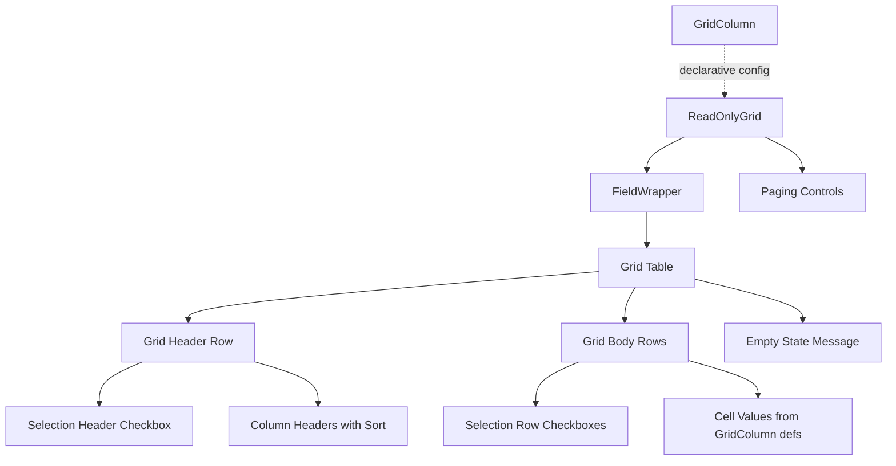

# Design Document: ReadOnlyGrid

## Overview

The ReadOnlyGrid component is a React table component for the Sailwind library that displays tabular data with paging, sorting, row selection, and configurable column styling. It consists of two components:

- **ReadOnlyGrid** (`a!gridField` equivalent): The top-level grid container that manages data, paging state, sorting state, and selection state.
- **GridColumn** (`a!gridColumn` equivalent): A declarative column definition component that configures how a single column renders.

The grid manages all state internally (current page, sort field/direction) while exposing callbacks for selection changes. It reuses the existing `FieldWrapper` component for label, instructions, helpTooltip, and validation display, keeping the grid consistent with other Sailwind form components without adding complexity.

## Architecture



### State Management

The grid uses internal React state for:
- `currentPage` (number): Tracks which page of data is displayed
- `sortField` (string | null): The currently sorted field
- `sortAscending` (boolean): The current sort direction

Selection is controlled externally via `selectionValue` and `selectionSaveInto` props (controlled component pattern), consistent with how other Sailwind components handle state.

### Data Flow

1. Developer passes `data` (array of objects) and `children` (GridColumn elements) to ReadOnlyGrid
2. ReadOnlyGrid extracts column definitions from GridColumn children props
3. Data is sorted (if sort is active) → sliced for current page → rendered as table rows
4. Paging controls are computed from total data length and pageSize
5. Selection changes are propagated via `selectionSaveInto` callback

## Components and Interfaces

### GridColumn Component

GridColumn is a **configuration-only component** that renders nothing. ReadOnlyGrid reads its props to determine column behavior.

```typescript
export interface GridColumnProps {
  /** Text to display as the column header */
  label?: string;
  /** Field name used for sorting when this column header is clicked */
  sortField?: string;
  /** 
   * Display value for each cell. Can be:
   * - A string field name to look up on each row object
   * - A function (row: any, index: number) => React.ReactNode
   */
  value?: string | ((row: any, index: number) => React.ReactNode);
  /** Alignment for header and cell content */
  align?: SAILAlign;
  /** Column width */
  width?: SAILGridColumnWidth;
  /** Background color for cells - hex color or semantic name */
  backgroundColor?: string | ((row: any) => string);
  /** Whether this column is visible */
  showWhen?: boolean;
  /** Additional text for screen readers */
  accessibilityText?: string;
}

export const GridColumn: React.FC<GridColumnProps> = () => null;
```

### ReadOnlyGrid Component

```typescript
export interface ReadOnlyGridProps {
  /** Text to display as the grid label */
  label?: string;
  /** Determines where the label appears */
  labelPosition?: SAILLabelPosition;
  /** Supplemental text about this grid */
  instructions?: string;
  /** Displays a help icon with tooltip text */
  helpTooltip?: string;
  /** Text to display when no data is available */
  emptyGridMessage?: string;
  /** The data array to display */
  data?: Record<string, any>[];
  /** GridColumn children defining the columns */
  children?: React.ReactNode;
  /** Maximum rows per page. Default: 10 */
  pageSize?: number;
  /** Initial sort configurations */
  initialSorts?: SortInfo[];
  /** Whether rows are selectable */
  selectable?: boolean;
  /** Selection visual style */
  selectionStyle?: "CHECKBOX" | "ROW_HIGHLIGHT";
  /** Currently selected row identifiers */
  selectionValue?: (string | number)[];
  /** Callback when selection changes */
  selectionSaveInto?: (selectedIds: (string | number)[]) => void;
  /** Validation messages to display below the grid */
  validations?: string[];
  /** Whether the component is displayed */
  showWhen?: boolean;
  /** Cell spacing */
  spacing?: "STANDARD" | "DENSE";
  /** Grid height */
  height?: SAILGridHeight;
  /** Border style */
  borderStyle?: "STANDARD" | "LIGHT";
  /** Whether to shade alternate rows */
  shadeAlternateRows?: boolean;
  /** Index of column to use as row header for accessibility */
  rowHeader?: number;
  /** Additional text for screen readers */
  accessibilityText?: string;
  /** Space above component */
  marginAbove?: SAILMarginSize;
  /** Space below component */
  marginBelow?: SAILMarginSize;
}
```

### Supporting Types

```typescript
export interface SortInfo {
  field: string;
  ascending: boolean;
}

export type SAILGridHeight =
  | "SHORT" | "SHORT_PLUS"
  | "MEDIUM" | "MEDIUM_PLUS"
  | "TALL" | "TALL_PLUS"
  | "EXTRA_TALL" | "AUTO";

export type SAILGridColumnWidth =
  | "AUTO" | "ICON" | "ICON_PLUS"
  | "NARROW" | "NARROW_PLUS"
  | "MEDIUM" | "MEDIUM_PLUS"
  | "WIDE"
  | "1X" | "2X" | "3X" | "4X" | "5X"
  | "6X" | "7X" | "8X" | "9X" | "10X";
```


## Data Models

### Internal State Model

```typescript
interface GridInternalState {
  currentPage: number;        // 1-based page index
  sortField: string | null;   // currently sorted field name
  sortAscending: boolean;     // true = ascending, false = descending
}
```

### Column Definition (extracted from GridColumn children)

```typescript
interface ColumnDef {
  label?: string;
  sortField?: string;
  value?: string | ((row: any, index: number) => React.ReactNode);
  align?: SAILAlign;
  width?: SAILGridColumnWidth;
  backgroundColor?: string | ((row: any) => string);
  showWhen?: boolean;
  accessibilityText?: string;
}
```

### Paging Computation Model

```typescript
interface PagingState {
  totalItems: number;       // data.length
  pageSize: number;         // from props, default 10
  totalPages: number;       // Math.ceil(totalItems / pageSize)
  currentPage: number;      // 1-based
  startIndex: number;       // (currentPage - 1) * pageSize
  endIndex: number;         // Math.min(startIndex + pageSize, totalItems)
  hasPreviousPage: boolean; // currentPage > 1
  hasNextPage: boolean;     // currentPage < totalPages
}
```

### Row Identifier Strategy

Each row needs a stable identifier for selection. The grid uses the row's index in the original data array as the default identifier. If the data objects contain an `id` field, that is used instead. This keeps the API simple for prototyping.

### Width Mapping

Column widths map to Tailwind classes:

| SAIL Width | Tailwind Class | Approximate Size |
|-----------|---------------|-----------------|
| AUTO | (no width class) | Content-based |
| ICON | w-10 | 40px |
| ICON_PLUS | w-14 | 56px |
| NARROW | w-24 | 96px |
| NARROW_PLUS | w-32 | 128px |
| MEDIUM | w-40 | 160px |
| MEDIUM_PLUS | w-48 | 192px |
| WIDE | w-64 | 256px |
| 1X-10X | flex-[1]-flex-[10] | Proportional |

### Height Mapping

Grid heights map to max-height Tailwind classes with overflow-y-auto:

| SAIL Height | Tailwind Class |
|------------|---------------|
| SHORT | max-h-40 |
| SHORT_PLUS | max-h-52 |
| MEDIUM | max-h-64 |
| MEDIUM_PLUS | max-h-80 |
| TALL | max-h-96 |
| TALL_PLUS | max-h-[28rem] |
| EXTRA_TALL | max-h-[36rem] |
| AUTO | (no constraint) |

### Background Color Mapping

Semantic color names map to Tailwind classes:

| SAIL Color | Tailwind Class |
|-----------|---------------|
| NONE | (no class) |
| ACCENT | bg-blue-50 |
| SUCCESS | bg-green-50 |
| INFO | bg-sky-50 |
| WARN | bg-yellow-50 |
| ERROR | bg-red-50 |

Hex colors are applied via inline `style={{ backgroundColor }}`.


## Correctness Properties

*A property is a characteristic or behavior that should hold true across all valid executions of a system — essentially, a formal statement about what the system should do. Properties serve as the bridge between human-readable specifications and machine-verifiable correctness guarantees.*

### Property 1: Data rendering dimensions

*For any* non-empty data array of length N and any set of GridColumn definitions where M columns have showWhen !== false, the rendered table SHALL contain exactly N rows (or pageSize rows if N > pageSize) and exactly M columns.

**Validates: Requirements 1.1, 2.5**

### Property 2: Cell value resolution

*For any* data array and *for any* GridColumn with a value accessor (either a string field name or a function), each rendered cell in that column SHALL contain the result of resolving the accessor against the corresponding row object. For string accessors, this is `row[fieldName]`. For function accessors, this is `fn(row, index)`.

**Validates: Requirements 1.3, 1.4**

### Property 3: Column configuration application

*For any* GridColumn definition specifying label, align, width, and/or backgroundColor, the rendered column header SHALL display the label text, the header and cells SHALL have the corresponding alignment class, the column SHALL have the corresponding width class, and each cell SHALL have the corresponding background color applied.

**Validates: Requirements 2.1, 2.2, 2.3, 2.4**

### Property 4: Grid metadata rendering

*For any* ReadOnlyGrid with label, instructions, validations array, and accessibilityText provided, the rendered output SHALL contain the label text, the instructions text, all validation message strings, and the table element SHALL have the accessibilityText as its aria-label.

**Validates: Requirements 3.1, 3.3, 3.5, 3.6**

### Property 5: Paging row count constraint

*For any* data array of length N and *for any* pageSize P where N > P, the number of rendered data rows on any page SHALL be at most P, and on the last page SHALL equal N mod P (or P if N is evenly divisible).

**Validates: Requirements 4.1**

### Property 6: Page navigation round trip

*For any* data array spanning multiple pages, navigating forward one page and then backward one page SHALL return the grid to the same page displaying the same rows as before navigation.

**Validates: Requirements 4.3, 4.4**

### Property 7: Sort toggling behavior

*For any* data array and *for any* column with a sortField, clicking that column header once SHALL result in the displayed rows being sorted ascending by that field, and clicking the same header again SHALL result in the displayed rows being sorted descending by that field. A column header without a sortField SHALL not be interactive.

**Validates: Requirements 5.1, 5.2, 5.3, 5.6**

### Property 8: Initial sorts applied correctly

*For any* data array and *for any* initialSorts configuration, the grid SHALL render data on initial load in the order determined by applying those sorts sequentially.

**Validates: Requirements 5.5**

### Property 9: Selection toggle updates identifiers

*For any* selectable grid and *for any* unselected row, clicking that row's checkbox SHALL result in selectionSaveInto being called with an array that includes that row's identifier. Clicking the same row's checkbox again SHALL result in selectionSaveInto being called with an array that excludes that row's identifier.

**Validates: Requirements 6.2**

### Property 10: Select-all / deselect-all round trip

*For any* selectable grid displaying P rows on the current page, clicking the header checkbox when no rows are selected SHALL result in all P row identifiers being selected. Clicking the header checkbox again SHALL result in all P row identifiers being deselected, returning to the original empty selection state.

**Validates: Requirements 6.3, 6.4**

### Property 11: Pre-selected rows render as selected

*For any* selectable grid and *for any* selectionValue array, every row whose identifier is in selectionValue SHALL render as visually selected (checked checkbox or highlighted row), and every row whose identifier is not in selectionValue SHALL render as unselected.

**Validates: Requirements 6.5**

### Property 12: Alternate row shading pattern

*For any* data array with shadeAlternateRows set to true, every even-indexed row (0-based) SHALL have a shaded background class and every odd-indexed row SHALL not, or vice versa, maintaining a strict alternating pattern.

**Validates: Requirements 7.3**

### Property 13: Fixed height constrains grid body

*For any* height value that is not "AUTO", the grid body container SHALL have the corresponding max-height CSS class and overflow-y set to auto, enabling vertical scrolling when content exceeds the height.

**Validates: Requirements 7.5**

## Error Handling

| Scenario | Behavior |
|----------|----------|
| `data` is undefined or null | Treat as empty array, show emptyGridMessage |
| `data` is not an array | Treat as empty array, show emptyGridMessage |
| `pageSize` is 0 or negative | Default to 10 |
| `currentPage` exceeds total pages (e.g., after data changes) | Reset to last valid page |
| Column `value` accessor throws | Render empty cell, log warning to console |
| Column `value` field name not found on row | Render empty cell (undefined) |
| `selectionSaveInto` not provided when `selectable` is true | Selection checkboxes render but clicks are no-ops |
| `backgroundColor` is invalid hex | Ignore, no background applied |

## Testing Strategy

### Test Framework Setup

The project currently has no test runner. We need to add:
- **vitest**: Fast Vite-native test runner with React Testing Library support
- **@testing-library/react** + **@testing-library/jest-dom**: For rendering and asserting on React components
- **fast-check**: Property-based testing library for generating random inputs

### Unit Tests

Unit tests cover specific examples, edge cases, and error conditions:
- Empty data renders empty message
- Default pageSize is 10
- showWhen=false renders nothing
- borderStyle "STANDARD" vs "LIGHT" applies correct classes
- selectionStyle "ROW_HIGHLIGHT" renders highlights instead of checkboxes
- labelPosition "COLLAPSED" hides label visually
- First page disables previous button, last page disables next button
- Single-page data hides paging controls

### Property-Based Tests

Property tests use fast-check to verify universal properties across randomly generated inputs. Each property test:
- Runs a minimum of 100 iterations
- References its design document property number
- Uses tag format: **Feature: read-only-grid, Property {N}: {title}**

Properties to implement as fast-check tests:
1. Data rendering dimensions (Property 1)
2. Cell value resolution (Property 2)
3. Column configuration application (Property 3)
4. Grid metadata rendering (Property 4)
5. Paging row count constraint (Property 5)
6. Page navigation round trip (Property 6)
7. Sort toggling behavior (Property 7)
8. Initial sorts applied (Property 8)
9. Selection toggle (Property 9)
10. Select-all round trip (Property 10)
11. Pre-selected rows (Property 11)
12. Alternate row shading (Property 12)
13. Fixed height constraint (Property 13)

### Test Organization

Tests live alongside the component:
- `src/components/ReadOnlyGrid/ReadOnlyGrid.test.tsx` — unit tests
- `src/components/ReadOnlyGrid/ReadOnlyGrid.properties.test.tsx` — property-based tests

### PBT Library

- **Library**: fast-check (TypeScript-native, works with vitest)
- **Min iterations**: 100 per property
- **Generators**: Custom arbitraries for data arrays, column configs, sort configs, and selection states
