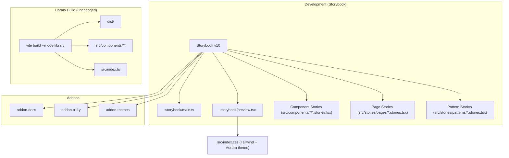

# Design Document: Storybook Migration

## Overview

This design describes how to replace Sailwind's custom Vite dev app (wouter routing, `src/demos/`, `src/pages/`) with Storybook v10 as the primary development and documentation interface. The Propeller sibling project provides a proven reference configuration. The migration involves three main efforts: (1) installing and configuring Storybook, (2) converting existing demos and pages into Storybook stories, and (3) removing the now-redundant custom app scaffolding.

The library build (`build:lib`) remains completely untouched — Storybook is a dev-time tool only.

## Architecture



### Key Architectural Decisions

1. **Component stories co-located**: `.stories.tsx` files live next to their component source (e.g., `src/components/Button/Button.stories.tsx`). This follows the Propeller pattern and keeps related files together.

2. **Page/Pattern stories in `src/stories/`**: Since pages and patterns are compositions (not library exports), their stories live in a dedicated `src/stories/` directory rather than next to the page source files that will be deleted.

3. **No vitest addon initially**: Unlike Propeller, Sailwind doesn't currently have vitest. The `@storybook/addon-vitest` addon can be added later if testing is introduced. This keeps the initial migration focused.

4. **Preserve existing CSS**: The `src/index.css` file with Tailwind v4, Open Sans font, and Aurora color palette is imported in `preview.tsx` — no CSS changes needed.

## Components and Interfaces

### Storybook Configuration Files

#### `.storybook/main.ts`

```typescript
import type { StorybookConfig } from '@storybook/react-vite'

const config: StorybookConfig = {
  stories: [
    '../src/**/*.stories.@(ts|tsx)',
  ],
  addons: [
    '@storybook/addon-docs',
    '@storybook/addon-a11y',
    '@storybook/addon-themes',
  ],
  framework: '@storybook/react-vite',
}

export default config
```

#### `.storybook/preview.tsx`

```tsx
import type { Preview } from '@storybook/react-vite'
import '../src/index.css'

const preview: Preview = {
  parameters: {
    controls: {
      matchers: {
        color: /(background|color)$/i,
        date: /Date$/i,
      },
    },
    a11y: {
      test: 'todo',
    },
  },
}

export default preview
```

Note: Unlike Propeller, Sailwind does not use a light/dark theme system — it has a single Aurora-based color palette. The `@storybook/addon-themes` addon is included for future use but no theme decorator is configured initially.

### Story File Patterns

#### Component Story (co-located)

Each component gets a `.stories.tsx` file in its directory. The story content is derived from the corresponding demo file.

```
src/components/Button/
├── ButtonWidget.tsx
├── ButtonArrayLayout.tsx
├── index.ts
└── Button.stories.tsx        ← NEW
```

Story structure:
```tsx
import type { Meta, StoryObj } from '@storybook/react-vite'
import { ButtonWidget } from './ButtonWidget'

const meta = {
  title: 'Components/Button',
  component: ButtonWidget,
  tags: ['autodocs'],
  parameters: { layout: 'centered' },
} satisfies Meta<typeof ButtonWidget>

export default meta
type Story = StoryObj<typeof meta>

export const Default: Story = {
  args: { label: 'Submit', style: 'SOLID', color: 'ACCENT' },
}

// Additional variant stories derived from ButtonsDemo.tsx...
```

#### Page/Pattern Story (in `src/stories/`)

```
src/stories/
├── pages/
│   ├── ESGConferenceRegistration.stories.tsx
│   ├── InsuranceQuoteWizard.stories.tsx
│   ├── ApplicationHeaderDemo.stories.tsx
│   └── ButtonTextFieldTest.stories.tsx
└── patterns/
    ├── TaskDashboard.stories.tsx
    ├── UserProfile.stories.tsx
    ├── FormEntry.stories.tsx
    ├── DocumentReview.stories.tsx
    ├── Publications.stories.tsx
    └── ApplicationStatus.stories.tsx
```

Page/pattern stories wrap the existing page component as a render function and use `fullscreen` layout:

```tsx
import type { Meta, StoryObj } from '@storybook/react-vite'
import { TaskDashboard } from '../../pages/patterns/TaskDashboard'

const meta = {
  title: 'Patterns/TaskDashboard',
  component: TaskDashboard,
  parameters: { layout: 'fullscreen' },
} satisfies Meta<typeof TaskDashboard>

export default meta
type Story = StoryObj<typeof meta>

export const Default: Story = {}
```

### Story Hierarchy

The Storybook sidebar will be organized as:

```
Components/
├── ApplicationHeader
├── Button
├── Card
├── Checkbox
├── Dialog
├── Dropdown
├── Heading
├── Image
├── MessageBanner
├── Milestone
├── ProgressBar
├── RadioButton
├── RichText
├── Slider
├── Stamp
├── Switch
├── Tabs
├── Tag
├── TextField
└── Toggle
Pages/
├── ESG Conference Registration
├── Insurance Quote Wizard
├── Application Header Demo
└── Button TextField Test
Patterns/
├── Application Status
├── Document Review
├── Form Entry
├── Publications
├── Task Dashboard
└── User Profile
```

### Demo-to-Story Migration Strategy

Each demo file in `src/demos/` maps to variant stories in the corresponding component story file. The migration approach:

1. Read the demo file to identify distinct visual states being demonstrated
2. Create one named story export per visual grouping (e.g., `SemanticColorsSolid`, `ButtonSizes`, `LinkStyle`)
3. Use Storybook `args` for simple prop variations, and `render` functions for compositions that use multiple sub-components (like `ButtonArrayLayout`)
4. Include the SAIL translation code block as a story description or in docs

### Components with Multiple Exports

Some Sailwind components export multiple related components (e.g., Button exports `ButtonWidget` and `ButtonArrayLayout`). For these:

- The primary component gets the `component` field in meta
- Related components get their own stories within the same file using `render` functions
- The `autodocs` page documents the primary component's props

## Data Models

No new data models are introduced. Storybook stories are purely presentational — they render existing Sailwind components with hardcoded props derived from the demo files.

### Dependencies Added (devDependencies only)

| Package | Purpose |
|---------|---------|
| `storybook` | Core Storybook CLI and runtime |
| `@storybook/react-vite` | React + Vite framework integration |
| `@storybook/addon-docs` | Auto-generated documentation pages |
| `@storybook/addon-a11y` | Accessibility testing panel |
| `@storybook/addon-themes` | Theme switching support |

### Dependencies Removed

| Package | Reason |
|---------|--------|
| `wouter` | Custom routing app replaced by Storybook |

### Files Removed After Migration

| File/Directory | Reason |
|----------------|--------|
| `src/App.tsx` | Custom routing app entry |
| `src/App.css` | Custom app styles |
| `src/main.tsx` | Custom app mount point |
| `src/pages/home.tsx` | Landing page (replaced by Storybook sidebar) |
| `src/pages/not-found.tsx` | 404 page (not needed in Storybook) |
| `src/pages/components.tsx` | Component gallery (replaced by Storybook) |
| `src/components/TableOfContents.tsx` | Navigation (replaced by Storybook sidebar) |
| `src/demos/` (entire directory) | All demos migrated to stories |

### Files Retained (moved content into stories)

| File/Directory | Reason |
|----------------|--------|
| `src/pages/patterns/*.tsx` | Pattern components are imported by pattern stories; can be removed once story render functions inline the content |
| `src/pages/ESGConferenceRegistration.tsx` | Imported by page story |
| `src/pages/InsuranceQuoteWizard.tsx` | Imported by page story |
| `src/pages/ApplicationHeaderDemo.tsx` | Imported by page story |
| `src/pages/ButtonTextFieldTest.tsx` | Imported by page story |


## Correctness Properties

*A property is a characteristic or behavior that should hold true across all valid executions of a system — essentially, a formal statement about what the system should do. Properties serve as the bridge between human-readable specifications and machine-verifiable correctness guarantees.*

This migration is primarily a structural/configuration task rather than a logic-heavy feature, so the testable properties focus on structural invariants of the story files and configuration.

### Property 1: Component stories are co-located and tagged for autodocs

*For any* Sailwind component directory in `src/components/`, a `.stories.tsx` file SHALL exist within that same directory, and that story file SHALL include `'autodocs'` in its `tags` array.

**Validates: Requirements 2.1, 2.2, 4.4**

### Property 2: All component stories export a Default story

*For any* component story file, the module SHALL export a named export called `Default`.

**Validates: Requirements 2.3**

### Property 3: Story titles follow category naming convention

*For any* story file located under `src/components/`, the meta `title` SHALL start with `"Components/"`. *For any* story file located under `src/stories/pages/`, the meta `title` SHALL start with `"Pages/"`. *For any* story file located under `src/stories/patterns/`, the meta `title` SHALL start with `"Patterns/"`.

**Validates: Requirements 4.1, 4.2, 4.3**

### Property 4: Page and pattern stories use fullscreen layout

*For any* story file under `src/stories/pages/` or `src/stories/patterns/`, the meta `parameters.layout` SHALL equal `"fullscreen"`.

**Validates: Requirements 3.4**

### Property 5: Storybook packages are devDependencies only

*For any* package in `package.json` whose name contains "storybook", that package SHALL appear in `devDependencies` and SHALL NOT appear in `dependencies`.

**Validates: Requirements 6.1**

## Error Handling

This feature is a development tooling migration with minimal runtime error surface. Key error scenarios:

1. **Storybook build failure**: If `npm run build-storybook` fails, the error output from Storybook CLI will indicate which story file has issues. Each story should be validated individually during development.

2. **Missing CSS styles**: If `preview.tsx` does not import `../src/index.css`, components will render without Tailwind styles. This is caught visually during development and by the configuration requirements (1.6).

3. **Story discovery failure**: If the `stories` glob in `main.ts` doesn't match file locations, stories won't appear in the sidebar. The glob pattern `../src/**/*.stories.@(ts|tsx)` covers both co-located component stories and the `src/stories/` directory.

4. **Library build contamination**: Story files use the `.stories.tsx` extension which is not matched by the library build entry point (`src/index.ts`). The existing `vite-plugin-dts` and rollup config already scope the build to exported modules only.

5. **Static asset references**: Page stories that reference images from `public/` (e.g., ESG logo, avatar) will work in Storybook since Vite serves the `public/` directory. No path changes needed.

## Testing Strategy

### Approach

Given that this is a structural migration (configuration + file creation + file deletion), the testing strategy emphasizes:

1. **Storybook build verification**: `npm run build-storybook` succeeding is the primary integration test — it validates that all stories compile, all imports resolve, and the configuration is correct.

2. **Library build verification**: `npm run build:lib` succeeding confirms the migration hasn't affected the published package.

3. **Structural property tests**: Automated checks that story files follow the required conventions (co-location, naming, exports, parameters).

### Property-Based Testing

Property-based testing library: **fast-check** (TypeScript, aligns with Propeller's setup)

Since the properties in this migration are structural (file system and file content checks), they are best implemented as parameterized tests that iterate over known component/page/pattern lists rather than random generation. Each test iterates over the full set of components (20 items minimum, exceeding the 100-iteration threshold for smaller sets).

Each property test should be tagged with:
- **Feature: storybook-migration, Property {N}: {title}**

### Unit Tests

Unit tests cover specific examples and edge cases:
- Storybook config file contains expected addons (Requirements 1.2, 1.3, 1.4)
- `package.json` contains `storybook` and `build-storybook` scripts (Requirements 5.1, 5.2)
- `package.json` retains `build:lib` script (Requirements 5.3)
- `wouter` is removed from dependencies (Requirements 7.1)
- Custom routing files are removed (Requirements 7.2)
- `src/demos/` directory is removed (Requirements 7.3)
- Page and pattern story files exist for all known pages/patterns (Requirements 3.1, 3.2)
